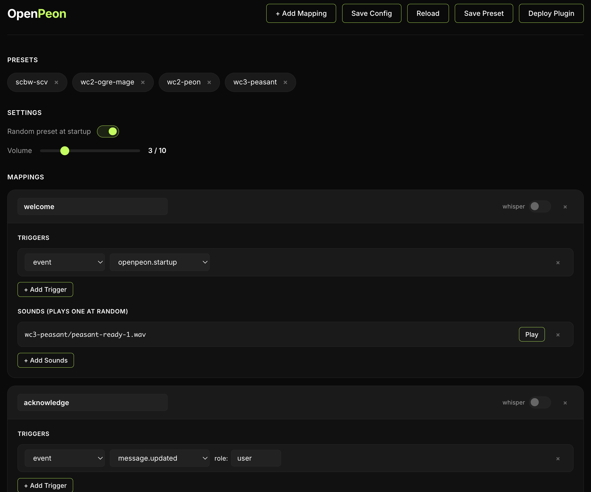

# OpenPeon

An [OpenCode](https://opencode.ai) plugin, [Claude Code](https://claude.com/claude-code) hook, and [pi](https://github.com/earendil-works/pi) extension that plays Blizzard RTS sound effects during your coding sessions.

Hear "Work complete!" when the agent finishes, peon acknowledgements when you send a message, and building sounds as tools run in the background.

## Sound Libraries

Includes sounds from multiple Blizzard RTS games:

- **Warcraft II** - Horde and Alliance units, buildings, and UI sounds
- **Warcraft III** - Peasant voice lines
- **StarCraft: Brood War** - Terran, Protoss, and Zerg units
- **StarCraft 2** - Terran, Protoss, and Zerg units

## Presets

Four presets are included out of the box:

| Preset | Theme |
|--------|-------|
| `wc2-peon` | Warcraft II Peon |
| `wc2-ogre-mage` | Warcraft II Ogre Mage |
| `wc3-peasant` | Warcraft III Peasant |
| `scbw-scv` | StarCraft: Brood War SCV |

Switch presets live from within OpenCode or pi:

```
Switch to the wc2-ogre-mage preset
```

The agent uses the `peon_switch_preset` tool, no restart required.

Set `"randomPreset": true` in `openpeon.json` to load a random preset each session. OpenCode and pi expose tools to switch it. Claude Code remembers the rolled preset for the session and uses the bundled `openpeon` skill for changes.

## Installation

### Requirements

- macOS with `afplay`, or Linux with PipeWire's `pw-play`
- [Bun](https://bun.sh) for the config UI

### Deploy with the UI (recommended)

```bash
bun run ui
```

Open http://localhost:3456, pick OpenCode, Claude Code, pi, or all three, and click Deploy Plugin. Each target gets its own self-contained install.

### Manual deploy to OpenCode

```bash
# Create plugin directory
mkdir -p ~/.config/opencode/plugins/openpeon

# Copy plugin code, config, sounds, and presets
cp index.js ~/.config/opencode/plugins/openpeon/
cp -R lib ~/.config/opencode/plugins/openpeon/
cp openpeon.json ~/.config/opencode/plugins/openpeon/
cp -R sounds ~/.config/opencode/plugins/openpeon/
cp -R ui/presets ~/.config/opencode/plugins/openpeon/presets
```

Create the loader file at `~/.config/opencode/plugins/openpeon.js`:

```javascript
export { OpenPeonPlugin } from "./openpeon/index.js"
```

Restart OpenCode after deployment.

### Manual deploy to Claude Code

```bash
# Create install directory
mkdir -p ~/.claude/openpeon

# Copy hook adapter, shared core, config, sounds, presets, and the tmux popup
cp -R claude ~/.claude/openpeon/
cp -R lib ~/.claude/openpeon/
cp openpeon.json ~/.claude/openpeon/
cp -R sounds ~/.claude/openpeon/
cp -R ui/presets ~/.claude/openpeon/presets
cp -R tmux ~/.claude/openpeon/
```

Then wire the hook into `~/.claude/settings.json`. Append the same entry to each of the seven events (`SessionStart`, `SessionEnd`, `UserPromptSubmit`, `Stop`, `PermissionRequest`, `PreToolUse`, `PostToolUse`), merging with any hooks you already have:

```json
{
  "hooks": {
    "Stop": [
      {
        "hooks": [
          {
            "type": "command",
            "async": true,
            "command": "\"$HOME/.bun/bin/bun\" \"$HOME/.claude/openpeon/claude/hook.js\""
          }
        ]
      }
    ]
  }
}
```

Hook changes apply to new Claude Code sessions; config and preset changes under `~/.claude/openpeon/` are picked up live on the next event.

### Manual deploy to pi

Choose one pi install method. To register the repository as a local pi package:

```bash
pi install .
```

Or use the config UI's pi target. It copies a self-contained install to `~/.pi/agent/openpeon/` and writes the extension loader at `~/.pi/agent/extensions/openpeon.ts`. Do not use both methods at once. Pi treats them as separate extension paths and would load OpenPeon twice. Run `/reload` in existing pi sessions after deploying.

## Config UI

A web-based UI for managing your sound configuration:



```bash
bun run ui
```

Open http://localhost:3456 to:

- Adjust volume (1-10)
- Toggle random preset on startup
- Add, remove, and edit mappings (triggers and sounds)
- Toggle whisper mode per mapping
- Browse and preview all available sounds
- Save and load presets
- Deploy to OpenCode, Claude Code, pi, or all three

## Configuration

The `openpeon.json` file maps triggers to sounds:

```json
{
  "volume": 3,
  "randomPreset": false,
  "mappings": [
    {
      "name": "acknowledge",
      "whisper": false,
      "triggers": [
        { "type": "event", "event": "message.updated", "role": "user" }
      ],
      "sounds": ["wc2-horde/peon-acknowledge-1.wav"]
    }
  ]
}
```

### Volume

`volume` (1-10) controls playback loudness. Uses an exponential curve for perceptually linear volume. Default is 5. Change at runtime via the `peon_set_volume` tool or the config UI.

### Whisper

Per-mapping `whisper` flag. When `true`, the mapping plays at volume 1 regardless of the global volume setting, except when the volume is 0: mute prevails on whisper, which prevails on volume. Useful for subtle background sounds on frequent triggers like tool executions.

### Trigger Types

| Type | Description |
|------|-------------|
| `event` | Coding-agent lifecycle events, with optional filters |
| `tool.before` | Fires before a tool executes |
| `tool.after` | Fires after a tool executes |

### Events

| Event | Description |
|-------|-------------|
| `openpeon.startup` | Plugin loaded (app startup) |
| `session.idle` | Agent finished working |
| `message.updated` | Message created/updated (filter with `"role": "user"`) |
| `permission.asked` | Permission prompt shown |
| `permission.replied` | User replied to permission prompt |
| `tui.command.execute` | TUI command executed |
| `command.executed` | CLI command executed |

### Tools (for tool.before/tool.after)

`question`, `bash`, `read`, `write`, `edit`, `glob`, `grep`, `task`, `webfetch`, `todowrite`, `todoread`, `skill`

## Claude Code Support

Claude Code has no plugin process: for each hook event it spawns `claude/hook.js`, which reads the event payload from stdin, translates it into OpenPeon's trigger vocabulary, and plays the matching sound through the same shared core, config, presets, and sounds as the OpenCode plugin.

| Claude Code hook | OpenPeon trigger |
|------------------|------------------|
| `SessionStart` | `openpeon.startup` |
| `UserPromptSubmit` | `message.updated` with role `user` |
| `Stop` | `session.idle` |
| `PermissionRequest` | `permission.asked` |
| `PreToolUse` / `PostToolUse` | `tool.before` / `tool.after` |

Tool names are mapped (`Bash` > `bash`, `AskUserQuestion` > `question`, `WebFetch` > `webfetch`, ...); unknown tools fall back to their lowercased name. With `randomPreset` on, the preset rolled for a session is stored in `~/.claude/openpeon/state/<session_id>.json`, reused for every event of that session, and deleted when the session ends.

The state file is also the per-session control surface. It accepts a `volume` override (`{"preset": "wc2-peon", "volume": 2}`) with precedence state volume > preset volume > base volume, so a session can be turned down or muted without touching any shared file. A `"whisper": false` key disables mapping `whisper` flags for the session, so whispered sounds (the working-hard mappings) play at the normal session volume instead of the fixed quiet whisper volume. The deploy installs an `openpeon` skill at `~/.claude/skills/openpeon/` that teaches Claude how to do this, so requests like "switch to the peasant preset" or "mute the sounds for this session" just work in chat.

## pi support

Pi loads `pi/index.ts` as a native extension. The adapter keeps OpenPeon's existing trigger names, so the same config and presets work across all supported agents.

| pi event | OpenPeon trigger |
|----------|------------------|
| `session_start` | `openpeon.startup` |
| `input` | `message.updated` with role `user` |
| `agent_settled` | `session.idle` |
| `user_bash` | `command.executed` and `tui.command.execute` |
| `tool_execution_start` / `tool_execution_end` | `tool.before` / `tool.after` |

Pi has no general permission event. OpenPeon treats question tool start and completion as `permission.asked` and `permission.replied`. This covers pi's interactive question tools, but not authorization dialogs outside pi's extension API.

The extension registers `peon_list_presets`, `peon_switch_preset`, `peon_current_config`, and `peon_set_volume`. Random presets are picked on `session_start`. A `/reload` refreshes config without replaying the startup sound. JSON and print sessions stay muted, so pi subagents do not duplicate the parent session's sounds.

## tmux popup

A tmux key can pop up a small volume/preset control for the Claude Code
session running in the current window, without typing anything into the
session. Add to `~/.tmux.conf` (requires `jq`):

```
bind-key -n C-n run-shell -b "$HOME/.claude/openpeon/tmux/openpeon-popup.sh popup '#{client_name}' '#{pane_id}'"
```

The popup shows a volume bar, the whisper state, and the preset list: ←/→
(or h/l) adjust the volume, `m` mutes, `w` toggles whisper (off = whispered
working sounds play at full session volume), ↑/↓ (or k/j) and Enter switch
presets, `q` closes. Every change plays a sample sound so you hear what you
set, and applies on the session's very next sound (the hook re-reads config
per event).

Volume changes persist to the session state file AND the base
`openpeon.json`, so new sessions inherit them (until the next deploy);
preset and whisper changes are session-scoped so `randomPreset` keeps
rolling fresh sessions and whisper resets to on. The window's session is found via the claude process's working
directory matched against live state files; with several live sessions from
the same directory, the newest transcript wins.

Running OpenCode sessions cannot be controlled this way (the plugin holds
its config in memory): the popup tells you to use `peon_set_volume` /
`peon_switch_preset` in chat instead.

## Custom Tools

The OpenCode plugin and pi extension register these chat tools:

| Tool | Description |
|------|-------------|
| `peon_list_presets` | List available sound presets |
| `peon_switch_preset` | Switch to a different preset |
| `peon_current_config` | Show current config and active mappings |
| `peon_set_volume` | Set volume (0-10) |

On Claude Code the bundled `openpeon` skill handles the same requests by editing the session state file.

## Debug Mode

```bash
OPENPEON_DEBUG=1 opencode
OPENPEON_DEBUG=1 claude
OPENPEON_DEBUG=1 pi
```

OpenCode logs to `~/.config/opencode/openpeon-debug.log`. Claude Code logs to `~/.claude/openpeon/debug.log`. A UI-deployed pi extension logs to `~/.pi/agent/openpeon/debug.log`.

## Notes

- Audio playback uses `afplay` on macOS and `pw-play` on Linux. OpenPeon disables audio if neither player is available.
- Sounds can overlap (no single-flight guard)
- Preset switching is live, no restart required

## Credits

Sound files are from Warcraft II, Warcraft III, StarCraft: Brood War, and StarCraft 2 by Blizzard Entertainment.
